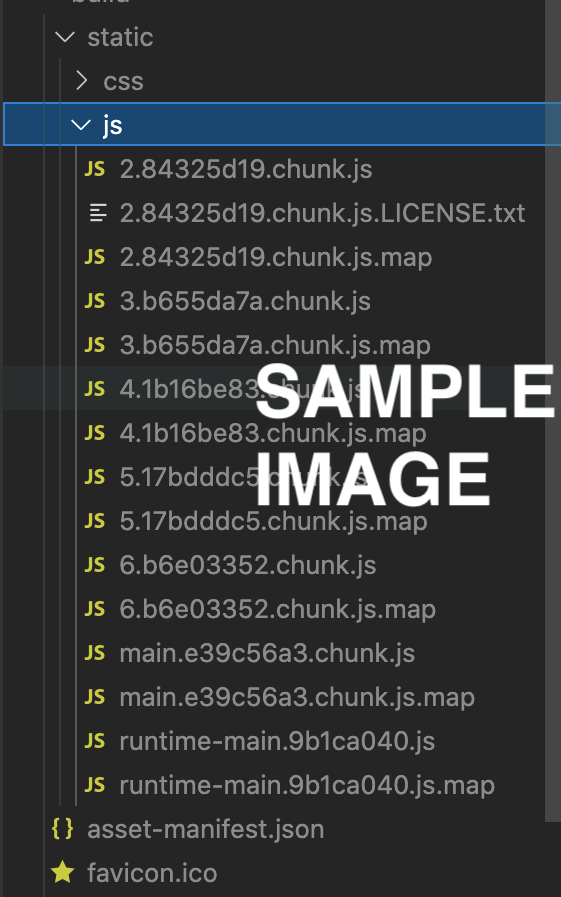

# Assignment 1 - Agile Software Practice.

__Name:__ ....your name .....

This repository contains the implementation of a React App, its associated Cypress tests and the GitLab CI pipeline.

## React App Features.

[ Provide a bullet-point list of the __new features__ you added to the React Movies app, as well as any modifications to existing features).] e.g.
 
+ Feature 1
+ Feature 2
+ Feature 3
+ etc
+ etc

## Automated Tests.

### Unique functionality testing (if relevant).

[Briefly explain the parts of your app's  functionality that are unique and state the associated test file name.] 

e.g.

__Favourite Movie tagging__ - The user can tag movies as their favourite, and those selected are listed on a separate page.

+ cypress/e2e/favourites.cy.js

__Feature X__ - The user can ......

+ cypress/e2e/featureX.cy.js

### Error/Exception testing (if relevant).

[State the cases that demonstrate error and/or exception testing.]

1. Display the Favourite Movies page when no movies have been tagged.
1. Submitting a Movie Review form when the user's name is blank.

### Cypress Custom commands (if relevant).

[ Specify the test file(s) that use a custom Cypress command(s) that you implemented.]

e.g.
+ cypress/e2e/filtering.cy.js
+ cypress/e2e/favourites.cy.js

## Code Splitting.

[Specify the pathname of each source code file that contains evidence of code splitting in your React app.]

e.g.
+ src/index.js
+ src/pages/favouriteMoviesPage.js
+ src/components/movieCard/index.js

## Pull Requests.

[ Specify the URL of the GitHub repository that contains a record of the Pull Requests made during this assignment's code (source code or test code). If you used GitLab Merge Requests instead, then simply state this.]

## Independent learning (If relevant).

[ Briefly explain the work you did to satisfy the requirements of the Outstanding grade category, and include proof (e.g. screenshots) of its success. Also, mention the files that contain evidence of this work.

State any other evidence of independent learning achieved while completing this assignment.

